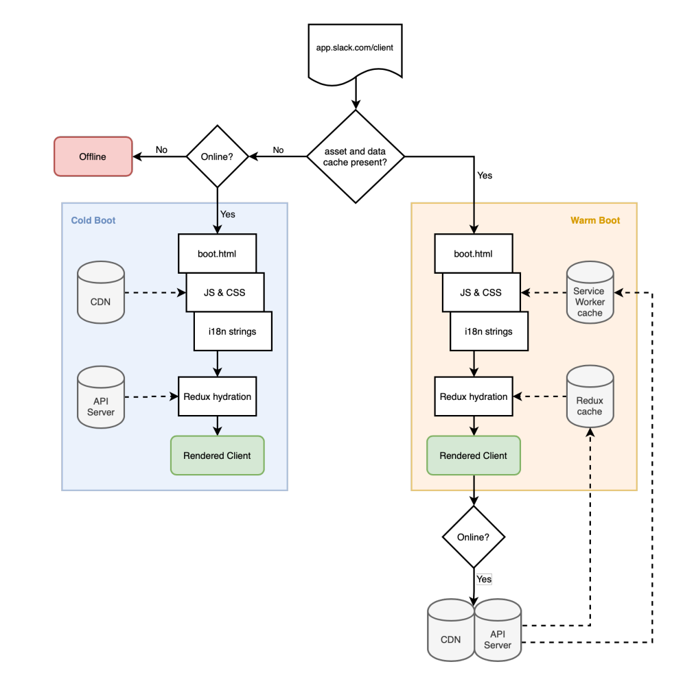
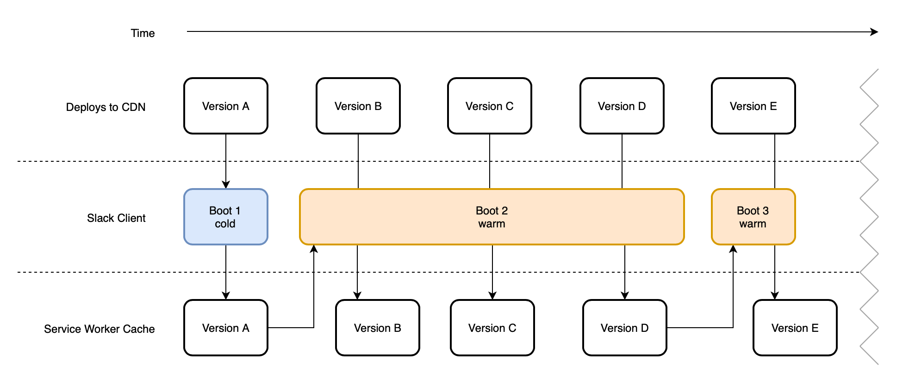

# How Slack Reduced Boot Time by More Than 50% Using Service Workers

Slack has become an indispensable tool for teams worldwide, offering seamless communication and collaboration. With users depending on it throughout their workday, performance is critical. Recognizing the need to improve boot times and provide offline functionality, Slack undertook a significant architectural overhaul. Central to this transformation was the** Service Worker**. In this blog, we’ll explore how Slack leveraged Service Workers to achieve a **50% reduction in boot tim**e and lay the groundwork for enhanced offline capabilities.

## Understanding the Problem
### Why Boot Time Matters
Slack’s desktop app is more than just a website; it’s a productivity hub. Booting quickly allows users to access their workspaces, messages, and tools without unnecessary delays. Before the optimization, Slack’s boot time for users with 1-2 workspaces averaged **5 seconds**. For a tool integral to daily work, this delay was noticeable and needed improvement.

## The Challenges
- **Heavy Assets**: The app relied on fetching a significant number of assets (HTML, JavaScript, CSS, fonts, and sounds) over the network.
- **Network Dependency**: Every boot depended on the network’s reliability and speed, which introduced latency and variability.
- **No Offline Support**: Without cached assets, Slack couldn’t provide even limited functionality offline

## How Slack Leveraged Service Workers
### The New Architecture
Slack revamped architecture combined three key components:

1. **CDN-Cached HTML File**: A lightweight, pre-fetched HTML file ensured that the app’s structure loaded quickly.
2. ** Persisted Redux Store**: Slack’s in-memory state was pushed to IndexedDB, enabling fast retrieval on subsequent boots.
3.  **Service Worker**: The star of the show, the Service Worker cached assets and handled network requests intelligently.

## How Slack Used the Service Worker
### Caching During the First Boot (Cold Boot)
When a user launches the new version of Slack for the first time, the app fetches a comprehensive set of assets, including:

-  **HTML, JavaScript, CSS:** The core files necessary for rendering and functionality.
- **Fonts and Sounds**: Assets that enhance the interface and experience.

These files are then stored in the **Service Workers** cache using the **Cache API**, a feature that allows the app to efficiently serve these resources during subsequent launches.

Additionally, Slack takes a snapshot of the **in-memory Redux store**, which holds the app's state, and saves it to **IndexedDB**, a browser-based database designed for larger amounts of structured data. This ensures that key application data is readily available for future sessions, reducing reliance on network connectivity.

### Detecting and Using Cached Data (Warm Boot)
During subsequent launches, Slack checks for the presence of cached assets and persisted data. This process follows two distinct pathways:

1.**Warm Boot:**

- If the required assets and state data are found in the cache and IndexedDB, Slack uses these resources to initialize the app.
- This drastically reduces boot times since the app doesn't need to re-fetch all assets from the network.
- Once the app is up and running, Slack fetches fresh data from the server (if the user is online) to ensure the app is up-to-date

2.**Cold Boot:**

- If no cached assets or persisted data exist (e.g., during a user's first launch), the app performs a "cold boot." This involves fetching all required resources from the network and storing them in the cache for future use.

### Handling Binary Assets
Binary assets such as images, PDFs, and videos are not explicitly managed by the Service Worker for offline use. Instead, these are handled by the browser’s default cache, controlled via standard HTTP cache headers. This allows Slack to focus the Service Worker’s caching logic on critical assets like scripts, styles, and application data.

### Unlocking Offline Functionality
While performance improvements were the primary goal, Service Workers also enabled basic offline capabilities:

- Users could boot Slack and access previously read messages.
- Unread markers could be synced once the user reconnected to the internet.

## New Challenges Arises 

### The "One Version Behind" Challenge
While the Service Worker drastically improved performance, it introduced a new issue: users were frequently **one version behind**. Slack releases updates multiple times a day, including bug fixes, performance improvements, and new features. With the initial implementation, users often booted with assets cached during their previous session, which could be a day old.

### Why Was This a Problem?
Slack users typically leave the app open for long hours during their workday. This long session duration, or "code shelf life," meant users rarely restarted the app, leaving them stuck with outdated assets for extended periods. Consequently, they missed out on timely fixes and enhancements.

### The Resolution: Jittered Interval Registration
Slack introduced **jittered interval registration** to solve this challenge. Here's how it works:

1. During active sessions, the Service Worker periodically checks for updates.
2. If a new deployment is detected, the Service Worker fetches and caches fresh assets in the background.
3. These assets are then used for the next boot, ensuring users have the latest version.

## Results
The introduction of Service Workers led to significant improvements:

- **Boot Time**: Reduced by over 50% compared to the legacy client.
- **Warm Boots**: Improved by 25% compared to cold boots.
- **Reliability**: Tens of millions of daily requests are now served through millions of installed Service Workers.

## Conclusion
By embracing Service Workers, Slack redefined its desktop app’s performance and user experience. The ability to cache assets locally, reduce network dependency, and provide offline functionality has made Slack faster and more reliable for users worldwide.

